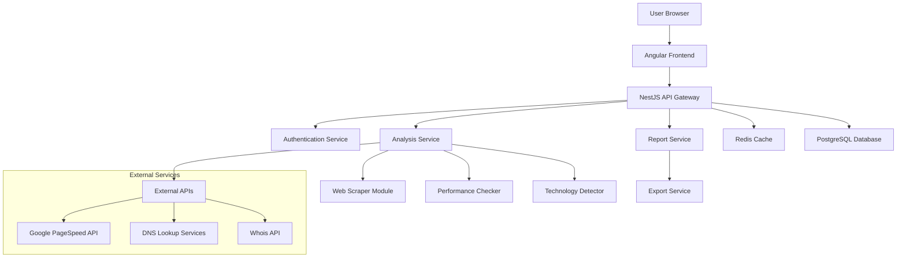

# Website Analysis & Performance Checker App

## Overview

A comprehensive web analytics and performance monitoring application that provides detailed insights into website traffic, performance metrics, and competitive analysis. Users can input any website URL and receive in-depth analytics similar to SimilarWeb, including traffic patterns, performance benchmarks, technology stack detection, and competitor insights.

### Key Capabilities
- **Traffic Analysis**: Unique visitors, page views, bounce rates, session duration
- **Performance Monitoring**: Page speed, TTFB, resource load times, mobile/desktop comparison
- **Technology Detection**: Frameworks, CMS, web servers, hosting providers
- **Competitive Intelligence**: Similar sites, traffic comparisons, market positioning
- **Historical Trends**: Time-series data with interactive charts and graphs
- **Export & Sharing**: CSV/PDF reports with customizable metrics

## Features

### Core Features
- ✅ URL-based website analysis
- ✅ Real-time traffic metrics dashboard
- ✅ Performance scoring and recommendations
- ✅ Technology stack identification
- ✅ Competitor analysis and suggestions
- ✅ Historical data tracking and trends
- ✅ Social sharing capabilities
- ✅ Admin dashboard with usage analytics

### Advanced Features
- 🔄 Real-time monitoring and alerts
- 🔄 API integration with Google Analytics, SEMrush
- 🔄 Custom dashboard creation
- 🔄 White-label solutions

## System Architecture



## Architecture Diagrams

### 1. System Overview Diagram

```
┌─────────────────┐    ┌─────────────────┐    ┌─────────────────┐
│   Angular UI    │────│   NestJS API    │────│  PostgreSQL DB  │
│  (Frontend)     │    │   (Backend)     │    │   (Database)    │
└─────────────────┘    └─────────────────┘    └─────────────────┘
         │                       │                       │
         │              ┌─────────────────┐              │
         └──────────────│  Redis Cache    │──────────────┘
                        │   (Caching)     │
                        └─────────────────┘
```

### 2. Data Flow Diagram

```
┌──────────┐    ┌──────────────┐    ┌─────────────────┐    ┌──────────────┐
│   User   │───▶│ URL Input    │───▶│ Validation &    │───▶│ Cache Check  │
│          │    │ Component    │    │ Sanitization    │    │              │
└──────────┘    └──────────────┘    └─────────────────┘    └──────────────┘
                                                                   │
┌─────────────────┐    ┌──────────────┐    ┌─────────────────┐    │
│   Dashboard     │◀───│ Data         │◀───│ Analysis        │◀───┘
│   Display       │    │ Aggregation  │    │ Engine          │
└─────────────────┘    └──────────────┘    └─────────────────┘
                                                   │
                                    ┌─────────────────┐
                                    │ External APIs   │
                                    │ • PageSpeed     │
                                    │ • DNS Lookup    │
                                    │ • Whois Data    │
                                    └─────────────────┘
```

## Installation

### Prerequisites
- Node.js 18+
- Docker (optional)

### Quick Start

1. **Clone the repository**
```bash
git clone https://github.com/naveenfullstack/zap.git
```

2. **Install dependencies**
```bash
# Install frontend dependencies
npm install

# Install backend dependencies
cd api
npm install
```

3. **Start services**
```bash

# Start frontend
npm run Start

# Start backend (in new terminal)
cd api
npm run start:dev
```

**Built with ❤️ using Angular, NestJS, PostgreSQL, and Redis**